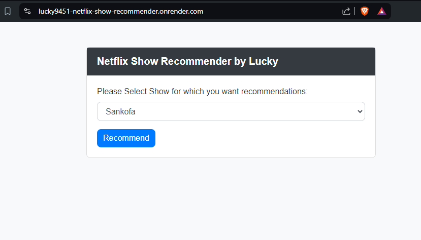
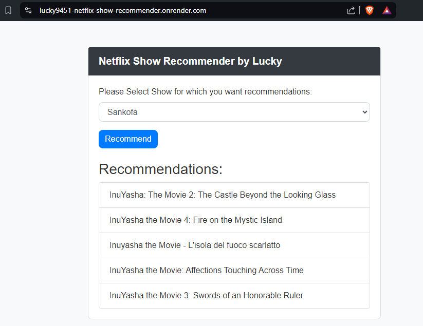

# Netflix Show Recommender using Flask, AI/ML

This project is a Netflix show recommender system that utilizes machine learning techniques to suggest shows based on user input. The application is built using Flask for the backend and deployed on Render. The recommender system uses cosine similarity to find shows similar to a given input show.


## Overview
- **Data Source**: `netflix_titles.csv`
- **Tech Stack**: Python, Flask, Pandas, Numpy, Scikit-learn, NLTK, HTML/CSS
- **Deployment**: Render


## Features

- Data preprocessing to clean and prepare the dataset
- Cosine similarity to find and recommend similar shows
- Flask web application for user interaction
- Deployment on Render for easy access


## Requirements

The following Python libraries are required:

```plaintext
blinker==1.8.2
click==8.1.7
colorama==0.4.6
Flask==3.0.3
gunicorn==22.0.0
itsdangerous==2.2.0
Jinja2==3.1.4
MarkupSafe==2.1.5
numpy==2.0.0
packaging==24.1
pandas==2.2.2
python-dateutil==2.9.0.post0
pytz==2024.1
six==1.16.0
tzdata==2024.1
Werkzeug==3.0.3
```

## Installation

### Step 1: Clone the Repository:

```bash
git clone https://github.com/Lucky9451/Lucky9451-Netflix-Show-Recommender-Project.git
cd Lucky9451-Netflix-Show-Recommender-Project
```

### Step 2: Install Required Libraries:

You can install the required Python libraries using pip:
```bash
pip install -r requirements.txt
```
## Usage

### Jupyter Notebook

1. Open the `.ipynb` file using Jupyter Notebook or Jupyter Lab.
2. Run the cells to preprocess the data and train the model.
3. Save the processed data and model using pickle:
    ```python
    import pickle
    pickle.dump(ntflx, open('netflix.pkl', 'wb'))
    pickle.dump(similarity, open('similarity.pkl', 'wb'))
    ```
4. Move the `netflix.pkl` and `similarity.pkl` files to the `Deployed Model` directory.

### Flask Application

1. Run the Flask application:
    ```bash
    python app.py
    ```

2. Open your web browser and navigate to `http://127.0.0.1:5000/`.

3. Select a show from the dropdown menu and get recommendations.
## Screenshots


1. **Home Page**:
    
    *The main interface where users can select a show and get recommendations.*

2. **Recommendations**:
    
    *Displays the list of recommended shows based on user input.*
## Deployment

1. **Push your project to GitHub**:
    - Initialize a new Git repository if you haven't already:
      ```bash
      git init
      ```
    - Add your files to the repository:
      ```bash
      git add .
      ```
    - Commit your changes:
      ```bash
      git commit -m "Initial commit"
      ```
    - Create a new repository on GitHub.
    - Link your local repository to the GitHub repository:
      ```bash
      git remote add origin https://github.com/yourusername/netflix-recommender.git
      ```
    - For the large file `similarity.pkl`, use Git LFS:
      ```bash
      git lfs install
      git lfs track "Deployed Model/similarity.pkl"
      git add .gitattributes
      ```
    - Push your project to GitHub:
      ```bash
      git add .
      git commit -m "Add project files"
      git push -u origin main
      ```

2. **Create an account on Render and link it to your GitHub account**:
    - Go to [Render](https://render.com) and sign up for an account.
    - After signing up, navigate to the Dashboard.
    - Click on the "New" button and select "Web Service".
    - Connect your GitHub account to Render and authorize access to your repositories.

3. **Create a new web service on Render**:
    - Select your repository from the list.
    - Choose the branch to deploy.
    - Set the build command to:
      ```bash
      pip install -r requirements.txt
      ```
    - Set the start command to:
      ```bash
      gunicorn app:app
      ```

4. **Deploy the service and access your application**:
    - Click on the "Create Web Service" button.
    - Wait for the deployment to complete.
    - Access your application via the provided URL.


## Directory Tree

```plaintext
├── Deployed Model
│   ├── netflix.pkl
│   └── similarity.pkl
├── Dataset
│   └── netflix_titles.csv
├── templates
│   └── index.html
├── app.py
├── requirements.txt
├── screenshots
│   ├── home_page.png
│   └── recommendations.png
├── netflix_recommender.ipynb
└── README.md
```
## Demo

A live demo of the application is available at: [Neflix-Show-Recommender](https://lucky9451-netflix-show-recommender.onrender.com/)


## Documentation

See the [Documentation](https://drive.google.com/file/d/1vyeodnpzcMEisArf6NIEbN27_IWG1_7V/view?usp=sharing).


## Authors

- [Lucky Verma](https://github.com/Lucky9451)

